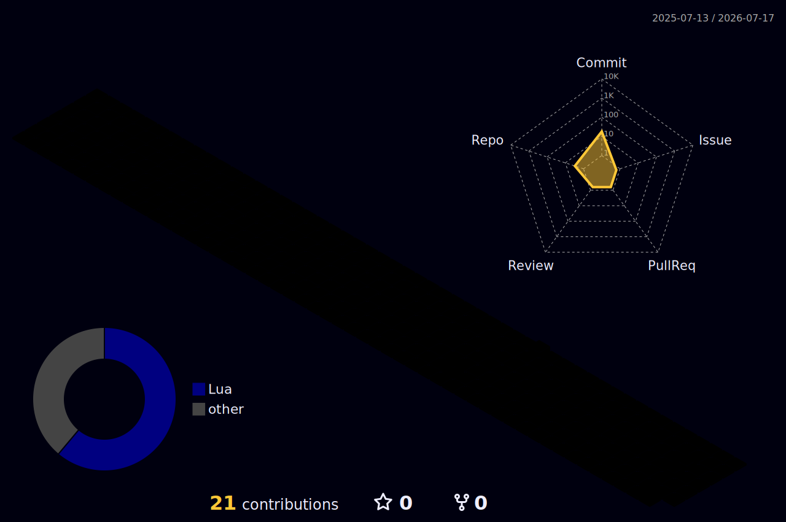

<h1 align="center">iwasawarenji954.exe</h1>

<p align="center">
  <code>Booting profile...</code><br>
  <code>Loading quests...</code><br>
  <code>Status: building something weirdly useful</code>
</p>

<p align="center">
  <a href="https://github.com/iwasawarenji954?tab=repositories">Repository Vault</a>
  ·
  <a href="https://github.com/iwasawarenji954?tab=stars">Star Map</a>
  ·
  <a href="https://github.com/iwasawarenji954?tab=followers">Party</a>
</p>

---

## Player Status

```txt
NAME        iwasawarenji954
CLASS       Builder / Learner / README Tinkerer
LEVEL       01
SPAWN       GitHub
MOOD        make it work -> make it fun -> make it yours
CURRENT     GitHub profile renovation
```

```txt
HP  [##########] curiosity
MP  [########--] focus
EXP [#####-----] shipped experiments
```

## Quest Board

| Quest | Status | Reward |
| --- | --- | --- |
| Turn the default GitHub profile into something memorable | In progress | +30 profile aura |
| Build small tools and leave visible traces | Active | +20 maker energy |
| Learn by touching real code | Active | +15 practical magic |
| Collect screenshots, demos, and project stories | Next | +25 portfolio power |
| Make someone say "I want a README like this" | Main quest | ??? |

## Terminal Log

```console
> whoami
iwasawarenji954

> cat interests.txt
web-development
ai-assisted-coding
developer-tools
small-experiments
github-profile-chaos

> run current_quest
Renovating this README into a tiny interactive-looking profile screen.

> unlock next
Add featured projects, GIFs, articles, and build logs as they appear.
```

## Inventory

<p>
  
  
  
  
</p>

```txt
EQUIPPED
- Keyboard of tiny experiments
- Notebook of half-formed ideas
- Debug lens
- "Let's just try it" button
```

## Battle Log

<p align="center">
  
</p>

<p align="center">
  
  
</p>

<p align="center">
  
</p>

## Unlocked Achievements

```txt
[x] Created the special profile repository
[x] Escaped the default README
[x] Pushed the first custom profile
[x] Opened the 3D contribution map portal
[ ] Add the first featured project
[ ] Add a demo GIF
[ ] Make the profile feel like a tiny game
```

## Secret Door

```txt
You found an unfinished room.

Future exhibits:
- featured projects
- learning logs
- screenshots
- tiny web toys
- notes from experiments

Come back later. The map is still expanding.
```

---

<p align="center">
  <code>save point reached</code>
</p>
