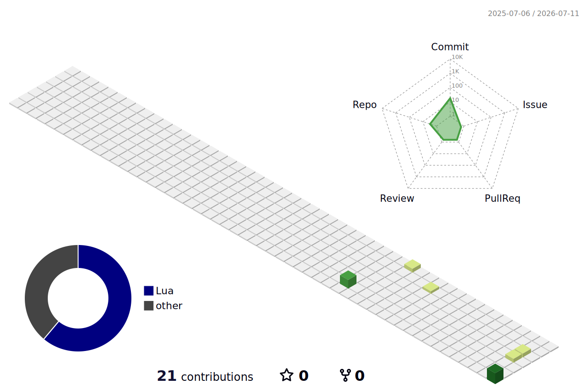

<h1 align="center">iwasawarenji954</h1>

<p align="center">
  building small things, learning in public, keeping the map green.
</p>

<p align="center">
  <a href="https://github.com/iwasawarenji954?tab=repositories">repos</a>
  ·
  <a href="https://github.com/iwasawarenji954?tab=stars">stars</a>
  ·
  <a href="https://github.com/iwasawarenji954?tab=followers">network</a>
</p>

<p align="center">
  
</p>

```txt
now: making this profile quieter, cleaner, and a little more fun
```

<p align="center">
  
</p>
